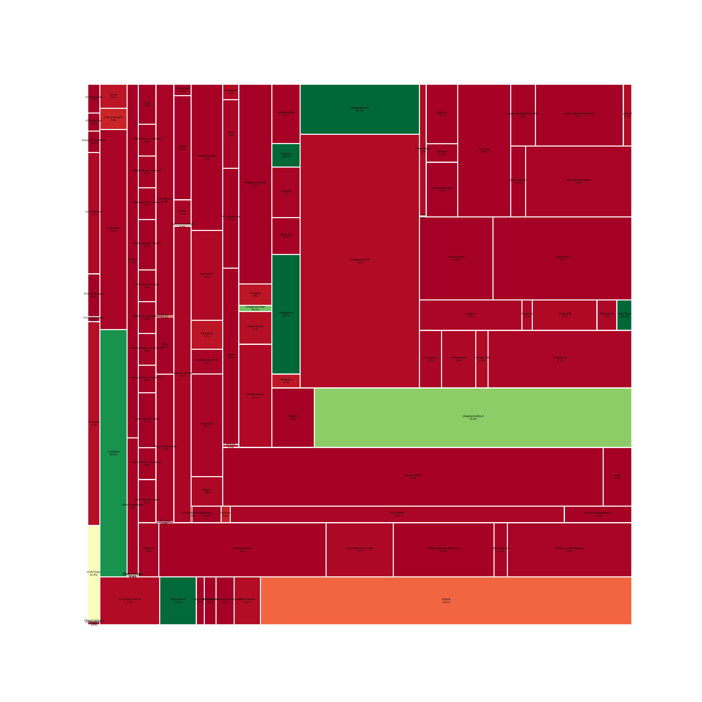

# regratka
Recompilation project of "Magiczna kula Papatki"

 

Configure project

```shell
python scripts\configure.py
```

Generate decompilation progress report
```shell
tools\objdiff-cli.exe report generate -o report.json -f json-pretty
```

Check changes in decompilation
```shell
tools\objdiff-cli.exe report changes baseline.json report.json -f json-pretty -o changes.json
```

Update progress visualization

```shell
python scripts\visualize_progress.py
```

Setup:
* msvc 6.6
* directX 8.1